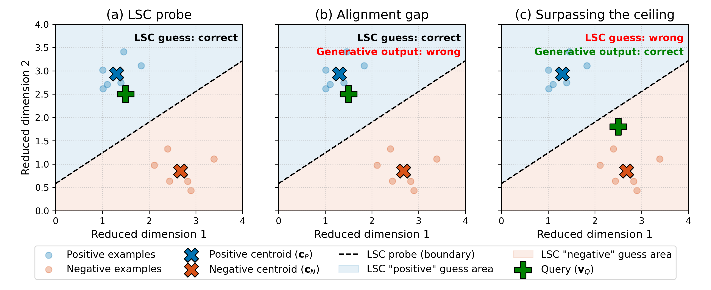
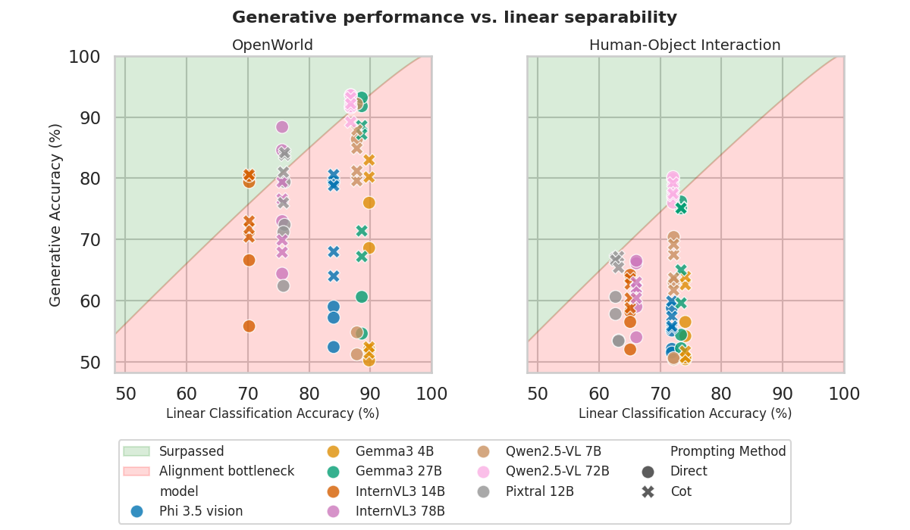

# Beyond the Linear Separability Ceiling: Aligning Representations in VLMs

Concepts illustrated:



SoTA models:



If you find these findings useful, consider referencing this work :)

```bibtex
@article{vompa2026beyond,
  title={Beyond the Linear Separability Ceiling: Aligning Representations in {VLM}s},
  author={Enrico Vompa and Tanel Tammet and Mohit Vaishnav},
  journal={Transactions on Machine Learning Research},
  issn={2835-8856},
  year={2026},
  url={https://openreview.net/forum?id=3uX4p80bN0},
  note={J2C Certification}
}
```

To be presented at NeurIPS 2026 conference

## Setting up the project
```bash
pip install -r requirements.txt
pip install flash-attn --no-build-isolation
```

## Datasets
OpenWorld dataset zip file can be downloaded and then `OPENWORLD_DATASET_PATH` variable set in `scripts/conf.py`
following these instructions: https://huggingface.co/datasets/rujiewu/Bongard-OpenWorld

HOI dataset tar file can be downloaded and then `HOI_DATASET_PATH` variable set in `scripts/conf.py`
following these instructions: https://github.com/NVlabs/Bongard-HOI/blob/master/assets/dataset.md

## Models
Huggingface models are used. Token and download path can be set in `scripts/conf.py`. 
Best PEFT checkpoints can be downloaded from: https://drive.google.com/drive/folders/14n3xMP64on6kuIORGDizDLXW4lS1_6DZ?usp=sharing
And then `PEFT_PATH` variable set in `scripts/conf.py` for evaluation

## Running experiments
Baselines, PEFT training, and evaluation can be ran using the `run_baselines.bash`, `run_train_peft.bash` and `run_eval_peft.bash` files.
PEFT models can be trained and evaluated on a single A100-80GB GPU. Some baselines however need up to 6 of these GPUs (InternVL3-78B)


